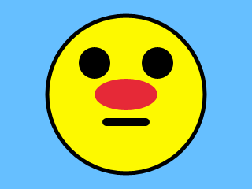

# null0

A fun and easy cross-language game-engine.

The idea is a cross-language, cross-platform game-engine for making nice 2D games. Fast, fun, and easy! You write your game in whatever language you like, and it will run (with no recompile) on any platform, including the web and low-end devices.




## Get Started

Install the [release](https://github.com/notnullgames/null0/releases) for your platform, and run:

```
# setup a new nim game called mygame
null0 new mygame
cd mygame

# build your nim game
null0 build

# run your game using the null0 runtime
null0 mygame.null0
```

This is for a nim-based game, and you will need nim installed. There will also be docker environments available eventually, so you don't have to install anything (other than docker.)

Eventually there will be lots more options for different languages and targets, and more options with null0 CLI to make it even easier to get started.

## Cart Layout

Carts (.null0) are just zip files. Any file in the cart can be read by your code. They have this layout:

```
├── game.json
├── icon.png
└── main.wasm
```

The `icon.png` and `game.json` are optional, but it will be used on the (eventual) community site:

```json
{
  "name": "Draw Image",
  "description": "Demo that animates an image moving down",
  "language": "nim",
  "tags": ["demo", "drawing", "images"],
  "author": "David Konsumer <@konsumer>",
  "source": "https://github.com/notnullgames/null-light/blob/main/carts/draw_image/main.nim"
}
```

Use `<@GITHUB_USER>` to link the game to your github account.

## Thanks

- [@guzbo](https://github.com/guzbo) and [@treeform](https://github.com/treeform) made many pieces of the engine (pixie, zippy, etc)
- [@beef331](https://github.com/beef331) made a nice wasm3 wrapper
- [@RobLoach](https://github.com/RobLoach) makes tons of useful libraries, although not used here directly, is always very helpful with advice & ideas
